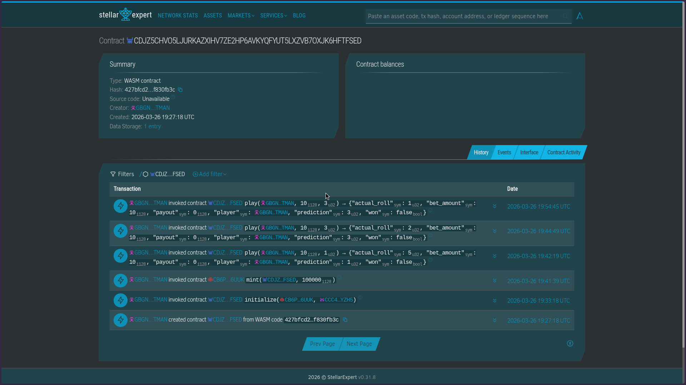
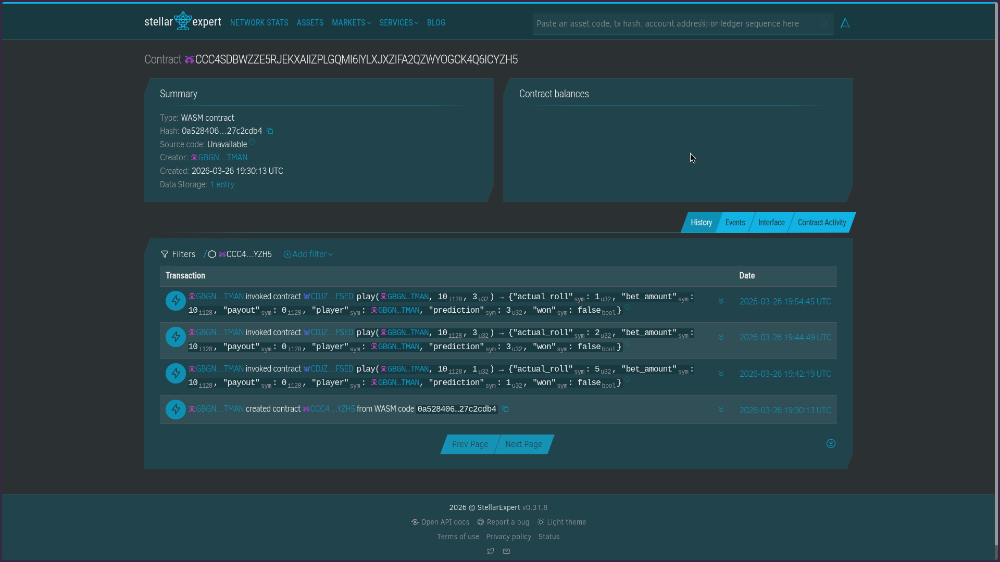
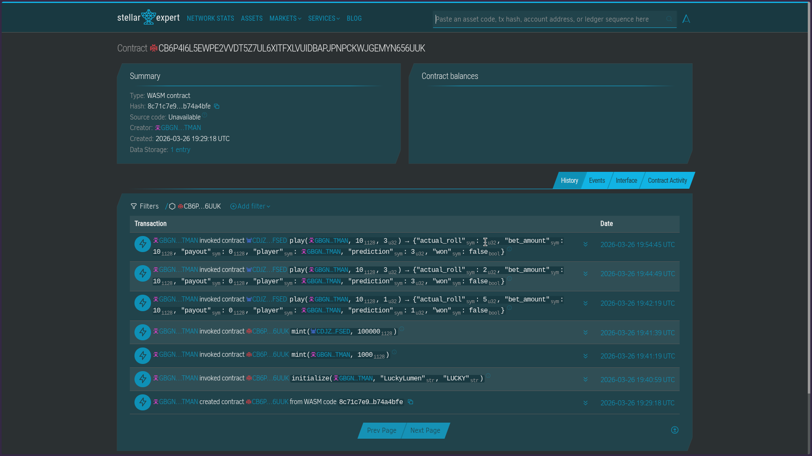
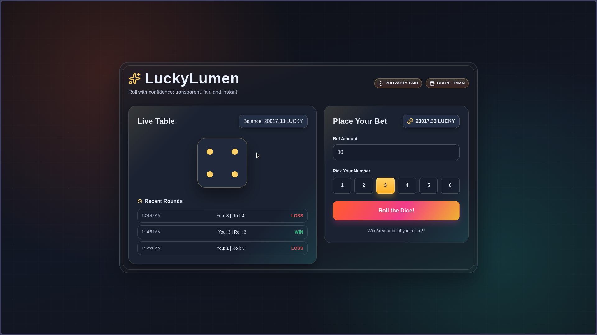
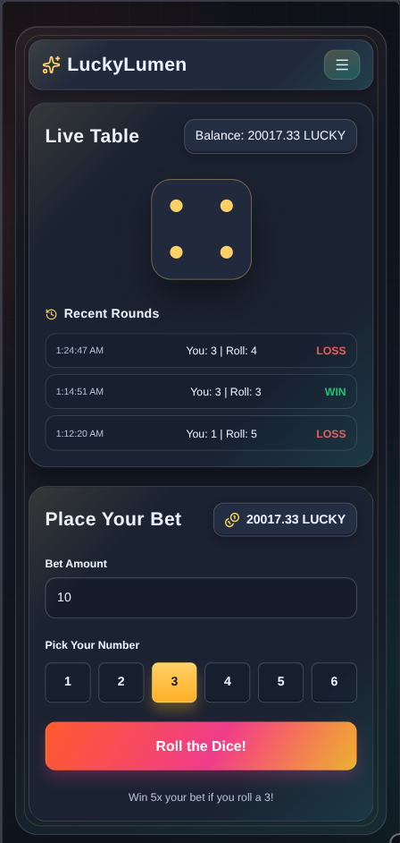
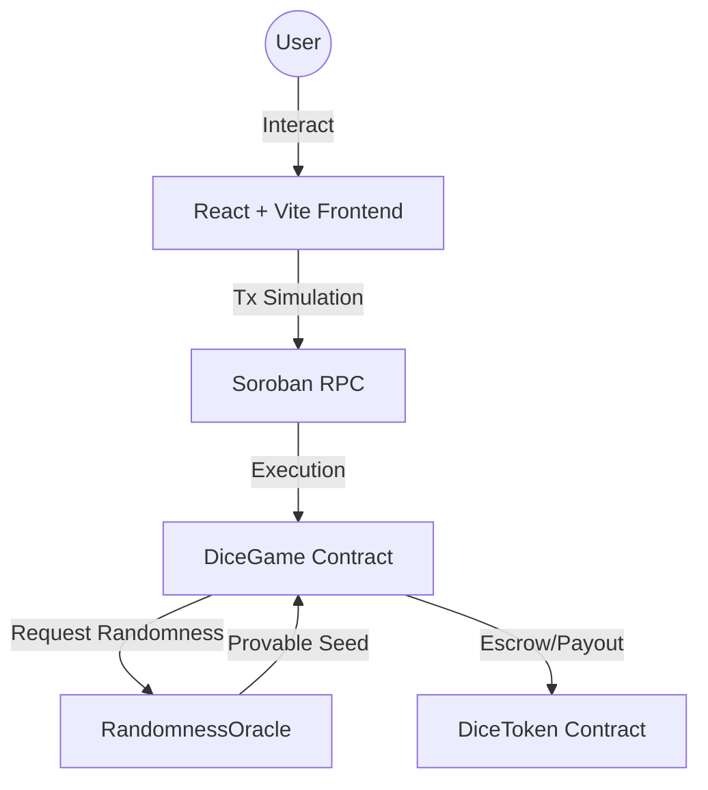
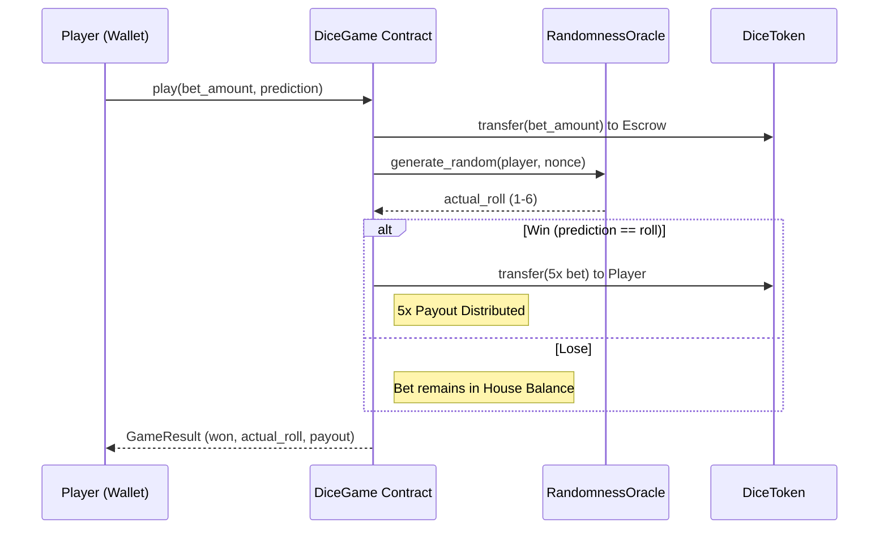

# LuckyLumen

[](https://github.com/sharifmdathar/luckylumen/actions/workflows/ci.yml)
[](https://www.codefactor.io/repository/github/sharifmdathar/luckylumen)

## Project Description

LuckyLumen is a provably fair dice game built on the Stellar blockchain. It combines on-chain game logic, verifiable randomness, and a modern web interface so users can place bets with transparent and auditable outcomes.

## Demo Video

[](https://www.youtube.com/watch?v=iaRdAKXsySU)

## Project Vision

The vision of LuckyLumen is to make blockchain gaming more trustworthy and accessible by:

- delivering transparent game outcomes through smart contracts,
- reducing trust assumptions with provable randomness, and
- providing a simple, responsive UI for everyday users.

## Key Features

- Provably fair dice gameplay powered by Soroban smart contracts
- Randomness flow designed for transparent and verifiable outcomes
- Dedicated token contract for in-app betting mechanics
- React-based frontend with responsive design
- Stellar wallet and transaction integration

## How to Play

LuckyLumen is simple but rewarding. Here is how the game mechanics work:

1. **Connect Wallet**: Connect your Freighter wallet to interact with the Stellar testnet.
2. **Place a Bet**: Enter the amount of `DiceToken` you want to wager.
3. **Make a Prediction**: Select a number between **1 and 6**.
4. **Roll the Dice**: Submit your transaction. The smart contract will generate a provably fair random number via the `RandomnessOracle`.
5. **Win Big**: If the dice roll matches your prediction, you win **5x your bet**!
   - _Example: If you bet 10 tokens and roll a 3 as predicted, you receive 50 tokens back._

## Deployed Smartcontract Details

### Contract IDs and Transaction Hashes

| Contract         | Address / Contract ID                                      | Deployment Tx Hash                                                 |
| ---------------- | ---------------------------------------------------------- | ------------------------------------------------------------------ |
| DiceGame         | `CDJZ5CHVO5LJURKAZXIHV7ZE2HP6AVKYQFYUT5LXZVB7OXJK6HFTFSED` | `e05d73d367459dc8bb0bd4fd3b991a04e9e82ecf73fa8354059800e6051f4085` |
| RandomnessOracle | `CCC4SDBWZZE5RJEKXAIIZPLGQMI6IYLXJXZIFA2QZWYOGCK4Q6ICYZH5` | `4a91d28fce541d1e5aefb3b0ae0c4920c36c3709ef309d724ade110d87b6432e` |
| DiceToken        | `CB6P4I6L5EWPE2VVDT5Z7UL6XITFXLVUIDBAPJPNPCKWJGEMYN656UUK` | `69cc54c95e3eb47ca23419299e1a0b24ff40bdbaebad158e7b74f25f8e0f066f` |

### Token / Pool Address

- Token Address: `CB6P4I6L5EWPE2VVDT5Z7UL6XITFXLVUIDBAPJPNPCKWJGEMYN656UUK`
- Initialize Tx Hash: `4ee82fec5c7a49d5b7b7b467b420709d933d44d247d14b052964bb40f0f1fb4b`

### Block Explorer Screenshots

Add screenshots of each deployed contract from the block explorer under `docs/screenshots/contracts/`.

- DiceGame Explorer Screenshot: 
- RandomnessOracle Explorer Screenshot: 
- DiceToken Explorer Screenshot: 

## UI Screenshots

- Home / Betting Screen:

  

- Mobile View:

  

## Demo Link

https://luckylumen.vercel.app/

## CI/CD Status

- Workflow: `Test Suite` at `.github/workflows/ci.yml`
- GitHub Actions: https://github.com/sharifmdathar/luckylumen/actions/workflows/ci.yml
- Badge:
  [](https://github.com/sharifmdathar/luckylumen/actions/workflows/ci.yml)

## Project Setup Guide

### Prerequisites

- Node.js 18+ and npm
- Rust toolchain
- Soroban CLI
- A Stellar testnet account/funds for testing

### Steps

1. Clone the repository:
   ```bash
   git clone https://github.com/sharifmdathar/luckylumen.git
   cd luckylumen
   ```
2. Install frontend dependencies:
   ```bash
   cd frontend
   npm install
   ```
3. Start the frontend:
   ```bash
   npm run dev
   ```
4. Build contracts (from repo root, adjust paths as needed):
   ```bash
   # Example - replace with your actual contract build/deploy commands
   cargo build --target wasm32-unknown-unknown --release
   ```
5. Deploy contracts to Stellar network and update the Contract IDs section above.

### Testing
Run the smart contract test suite to verify game logic:
```bash
cd contracts/dice_game
cargo test
```

## Future Scope

- Add more game modes beyond dice (e.g., coin flip, roulette-style games)
- Introduce richer analytics and on-chain game history visualizations
- Improve wallet onboarding for first-time blockchain users
- Add comprehensive test coverage and CI workflows
- Expand token utility and reward mechanisms

## Architecture
LuckyLumen follows a modular architecture to separate concerns between gameplay, tokenomics, and randomness.

### System Overview


### Gameplay Sequence


## Tech Stack

- Soroban Smart Contracts (Rust)
- React + Vite
- Stellar SDK
- TailwindCSS

## License

MIT
